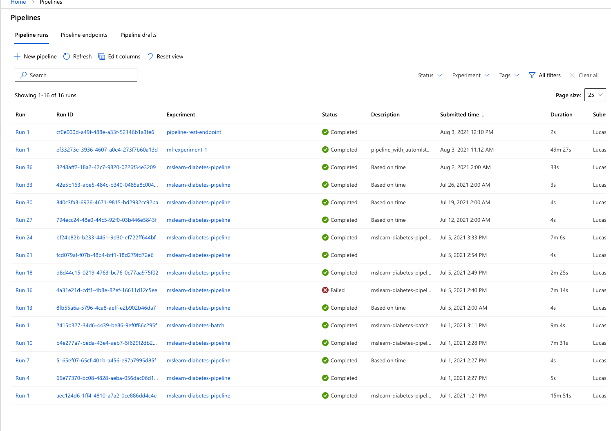

# How to operationalize a Machine Learning project with Azure ML

In this project I wil work on the [Bank Marketing dataset](https://automlsamplenotebookdata.blob.core.windows.net/automl-sample-notebook-data/bankmarketing_train.csv) and use Azure to configure a cloud based Machine Learning production model, deploy it, and consume it. To this we will also create, publish and consume a pipeline.

## Architectural Diagram

Let us have a look at the *Architectural Diagram* which help us in seeing the flow of a project and the steps that are critical for the process to work.

Each steps in the process is essentiel and important to understand.

- Dataset: At first we need to upload and register the data to AML.
- AutoML: In the process of running a AutoML we need to configure the; compute cluster, ML task and exit criterion. In doing that we train models on the data we uploaded in the last step.
- Best model: When the AutoML process has finished we can choose the model that has shown the best results and deploy it. For deploying it we can either use **Azure Container Instance (ACI)** or **Azure Kubernetes Service (AKS)**.
- Enable Application insight: Application insight help us keep track of our deployed model and how it perform and if there is problems with the requests. To enabled it you can either use python sdk or from the studio.
- Endpoint: When we have deployed the model we can start consuming it though a REST endpoint. From the endpoint we can send request and recieve predictions.
- Pipeline: Pipelines are used for automate the process of traning the model to deploying and consume it. With python sdk we can create and publish a pipeline.

### Future Work

The project is a beginner projects and can be impoved though various more advanced methos. We could use *parrallel run* in our pipeline to make the process faster. Also with the pipeline we could add a pipeline for the data preparation, so we could skip the manual task.

In the course we have looked at [Apache Benchmark](http://httpd.apache.org/docs/2.4/programs/ab.html) which is a tool for measuing performance. We could also include test and the program for measure the performance.

## Key steps

1) AutoML: At first we configure the AutoML run where we train several models on the data. Here we specify the compute cluser, ML task and other settings. After the run is done we can se what model has showned the best results. In our case the algoritme `VotingsEnsemble` has the highest accuracy on **0.92**.

### Dataset registed

### Experiment compledted

### The best model

2) Take the best model and deploy it: Now we have the best model we would like to deploy it so other can consume it. For doing that we use `ACI` so we can access endpoints though various services and interact with the model. 

### Application insights

3) Swagger: Now we need to build an REST Api (application programming interface) and to do that we use **Swagger** which is a tool that is very common to use for building REST Apis. Here we can make documentation for our colleagues so they now how to consume the model. It is also essentiel in the automated process so we can make request to the site.

### My Swagger output

4) Consume endpoint: The model is deployed and we now need to consume it. For consuming the endpoing we use the given scropt endpoint.py where we can interact with the model and make predictions.

### My output for endpoint.py

5) Create, Publish and consume a pipeline: Pipelines is the process of automat the MLOps process. Here we build scripts that run everytime we want to consume the model. We want to publish it so other user can interact with it and consume it.

### Publied pipeline

### Endpoint pipeline

### Running pipeline

### Rest pipeline

### Run pipeline

### Completed pipeline

### Scheduled pipeline

## Screen Recording

For showing the process I have made a short video where I highlight the process of creating a model to consuming it and can be seen at [youtube](https://www.youtube.com/watch?v=UuzyFGixeps). 